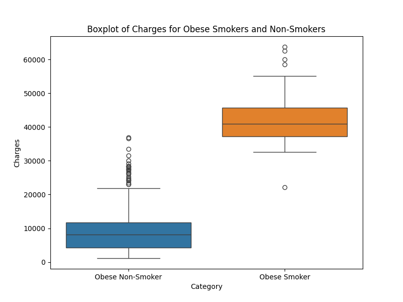
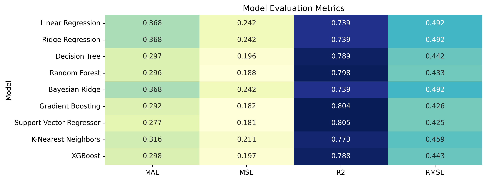

# Regression Project 
Notebook: [regression_fowler.ipynb](https://github.com/drpafowler/ml-final/blob/main/regression_fowler.ipynb)  
Dataset: [Medical Cost Personal Dataset](https://www.kaggle.com/datasets/mirichoi0218/insurance)

## Overview
This project seeks to build a regression model to predict health care costs based on a number of variables.

## Key Observations 

The key observation from this model is that obesity and smoking are two predictors of higher health care costs. The highest costs are associated with both those individuals that are obese and smokers.  

## Author(s)
Philip Fowler

